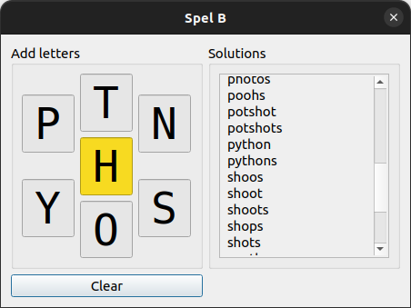

# Spel B

Spice up your life with **Spel B**, a handy little solver for the NY Times' [Spelling Bee](https://www.nytimes.com/puzzles/spelling-bee) puzzles. I wrote a CLI version of this years ago, and finally got around to adding a PyQt GUI.

I'm planning to create a native Linux app for this, but for now you need:

* Python >= 3.8 (I'm using 3.10.4)
* PyQt6 (6.3.1)